# grantseal v2 wire protocol

[English](./protocol-v2.md) | [中文文档](../zhCN/protocol-v2.md) — back to the [project README](../../README.md)

Related docs: [architecture](./architecture.md) · [security](../../SECURITY.md)

This document is the **normative machine-protocol specification** for grantseal's
v2 wire format. It records exactly what an issuer produces and a client
verifies on the wire: byte-level canonicalization, envelope/payload grammar,
signature input, encoding rules, and the compatibility freeze. It is not a
product introduction. Every rule here is pinned to code in `pkg/license` and
`internal/issuer` and to the golden vectors in
[`pkg/license/canonical_golden_test.go`](../../pkg/license/canonical_golden_test.go).
Where this document and the code disagree, the code (and its golden tests) win.

## 1. Schema version

- License payloads carry `schema_version` and this build understands **exactly
  one** value: `LicenseSchemaVersion = 2`
  ([`pkg/license/model.go`](../../pkg/license/model.go)). Any other value is
  rejected fail-closed with `LICENSE_UNSUPPORTED_SCHEMA` — there is no silent
  downgrade to a legacy shape.
- Revocation lists carry an independent `schema_version` with current value
  `RevocationSchemaVersion = 2`. v2 adds replay-resistance metadata (`list_id`,
  `sequence`, `expires_at`) over the legacy v1 shape. A v1 list is rejected by
  default (`LICENSE_UNSUPPORTED_SCHEMA`) and accepted only via an explicit
  `RevocationPolicy.AllowLegacyV1` opt-in.
- The two version numbers are separate: a license and a revocation list are
  distinct artifact classes with distinct signing domains (see §6).

## 2. Canonical representation

The signature covers a single, deterministic byte sequence — the **canonical
JSON** of the payload — produced by
[`pkg/license/canonical.go`](../../pkg/license/canonical.go). The algorithm is:

1. `json.Marshal` the Go struct so `time.Time` and other types take their
   canonical JSON form.
2. Decode into a generic tree with `json.Decoder.UseNumber()`, preserving number
   fidelity (no float re-formatting).
3. Re-encode recursively:
   - every object's keys are sorted with Go's `sort.Strings` (**byte-wise
     lexicographic order of the UTF-8 key bytes**, not Unicode collation),
   - **no insignificant whitespace** — no spaces, no newlines, no indentation,
   - HTML escaping is **disabled** (`SetEscapeHTML(false)`), so `<`, `>`, `&`
     are emitted literally,
   - `json.Number` scalars are written verbatim, `bool` as `true`/`false`,
     absent optionals via Go `omitempty` are simply not emitted.

This is **not** RFC 8785 JCS. In particular it does not apply JCS number
canonicalization or JCS-specific string escaping rules; it is grantseal's own
sorted-key, whitespace-free, HTML-unescaped scheme. Do not assume a generic JCS
implementation reproduces these bytes.

The canonical form is pinned by golden vectors. The minimal payload
(`schema_version = 2`, edition `basic`, lifetime, device mode `none`, issued at
`2024-01-02T03:04:05Z`, ids `l1`/`p1`/`k1`) canonicalizes to **exactly**:

```
{"customer_id":"","device_binding":{"mode":"none"},"edition":"basic","grace_period_days":0,"issued_at":"2024-01-02T03:04:05Z","key_id":"k1","license_id":"l1","license_type":"lifetime","product_id":"p1","schema_version":2,"serial_number":"","version_constraint":{}}
```

Note in the golden set: `<`, `>`, `&` are **not** escaped
(`"license_id":"l<&>2"`, `"customer_name":"Ünïcode <b>&amp;</b> 日本語"`), nested
maps are key-sorted (`"limits":{"a":1099511627776,"m":0,"z":3}`), and large
integers keep full fidelity (`1099511627776 == 2^40`).

## 3. Envelope grammar

A license on disk is a JSON `Envelope`
([`pkg/license/envelope.go`](../../pkg/license/envelope.go)); a revocation list
is the analogous `RevocationEnvelope`
([`pkg/license/revocation.go`](../../pkg/license/revocation.go)). Both carry the
same four fields:

| JSON field  | Go type     | Constraint                                              |
|-------------|-------------|---------------------------------------------------------|
| `algorithm` | `Algorithm` | Must be `"Ed25519"` (the only permitted value).         |
| `key_id`    | `string`    | Non-empty; identifies the verifying public key.         |
| `payload`   | `string`    | Base64URL of the **canonical** payload bytes (§2, §7).  |
| `signature` | `string`    | Base64URL of the raw Ed25519 signature (§5, §7).        |

Rules:

- The `payload` is the canonical bytes carried **verbatim** — the client decodes
  and verifies the exact bytes the issuer signed, never re-serializing them, so
  there is no canonicalization gap between issuer and client.
- On-disk files are **pretty-printed** JSON: `MarshalJSONIndent` uses two-space
  indentation, `SetEscapeHTML(false)`, and no trailing newline. The envelope
  wrapper's own indentation is not signed; only the decoded `payload` bytes are.
- Parsing (`ParseEnvelope` / `ParseRevocationEnvelope`) enforces the size cap
  (§10), decodes with the strict JSON rules (§9), and requires **all four
  fields to be non-empty** (empty `algorithm`/`key_id`/`payload`/`signature` is
  `LICENSE_MALFORMED`).

## 4. Payload grammar

### 4.1 License `Payload`

Field order in the Go struct is irrelevant; the canonical form (§2) is what gets
signed. JSON tags, types, and `omitempty` are normative:

| JSON field           | Go type             | omitempty | Notes / constraints                                                        |
|----------------------|---------------------|-----------|----------------------------------------------------------------------------|
| `schema_version`     | `int`               | no        | Must equal `2` (§1).                                                        |
| `license_id`         | `string`            | no        | Required, non-empty.                                                        |
| `serial_number`      | `string`            | no        | Always emitted (may be `""`).                                              |
| `product_id`         | `string`            | no        | Required, non-empty.                                                        |
| `customer_id`        | `string`            | no        | Always emitted (may be `""`).                                              |
| `customer_name`      | `string`            | yes       | Omitted when empty.                                                        |
| `edition`            | `Edition`           | no        | One of `trial`/`basic`/`professional`/`enterprise`.                        |
| `license_type`       | `LicenseType`       | no        | One of `trial`/`subscription`/`lifetime`.                                  |
| `issued_at`          | `time.Time`         | no        | Required, non-zero (§8).                                                    |
| `not_before`         | `*time.Time`        | yes       | Optional; omitted when nil (§8).                                           |
| `expires_at`         | `*time.Time`        | yes       | Optional; omitted when nil (§8, license_type invariants).                 |
| `grace_period_days`  | `int`               | no        | Range `[0, 3650]` (§10).                                                    |
| `features`           | `[]string`          | yes       | Omitted when empty; cardinality ≤ 256 (§10).                              |
| `limits`             | `map[string]int64`  | yes       | Omitted when empty; ≤ 256 entries; each value `[0, 2^40]` (§10).          |
| `device_binding`     | `DeviceBinding`     | no        | Always emitted (see §4.2).                                                 |
| `version_constraint` | `VersionConstraint` | no        | Always emitted (see §4.3); may serialize to `{}`.                          |
| `metadata`           | `map[string]string` | yes       | Omitted when empty; ≤ 256 entries; key/value ≤ 1024 bytes each (§10, §11). |
| `key_id`             | `string`            | no        | Required; must equal the envelope `key_id`.                                |

### 4.2 `DeviceBinding`

| JSON field   | Go type      | omitempty | Notes                                                          |
|--------------|--------------|-----------|----------------------------------------------------------------|
| `mode`       | `DeviceMode` | no        | One of `none`/`single`/`multi`.                                |
| `device_ids` | `[]string`   | yes       | Omitted when empty; cardinality ≤ 256 (§10).                   |

Mode/cardinality invariants (fail-closed, `LICENSE_MALFORMED` on violation):
`none` must carry **no** `device_ids`; `single` requires **exactly one**;
`multi` requires **at least one**. For `single`/`multi`, each `device_id` must
parse as a versioned fingerprint (`fp:v<N>:<algo>:<digest>`) or an explicit
opaque business identifier (`opaque:<ns>:<value>`); legacy bare values are
rejected.

### 4.3 `VersionConstraint`

| JSON field           | Go type      | omitempty | Notes                                              |
|----------------------|--------------|-----------|----------------------------------------------------|
| `min_version`        | `string`     | yes       | Optional dotted version string.                    |
| `max_version`        | `string`     | yes       | Optional dotted version string.                    |
| `maintenance_until`  | `*time.Time` | yes       | Optional; omitted when nil.                        |
| `covered_max_version`| `string`     | yes       | Optional; highest version covered post-maintenance.|

All fields are `omitempty`, so an unconstrained `version_constraint` serializes
to `{}` (as seen in the golden vectors).

### 4.4 Revocation `RevocationList`

| JSON field            | Go type      | omitempty | Notes                                                        |
|-----------------------|--------------|-----------|--------------------------------------------------------------|
| `schema_version`      | `int`        | no        | Must equal `2` for a v2 list (§1).                           |
| `list_id`             | `string`     | yes       | v2 requires non-empty; omitted only on the legacy v1 shape.  |
| `sequence`            | `uint64`     | yes       | v2 requires `> 0`; monotonically increasing high-water mark. |
| `issued_at`           | `time.Time`  | no        | Required, non-zero (§8).                                      |
| `expires_at`          | `*time.Time` | yes       | v2 requires non-nil and strictly after `issued_at`.          |
| `key_id`              | `string`     | no        | Must equal the envelope `key_id`.                            |
| `revoked_license_ids` | `[]string`   | no        | Entry count ≤ `MaxRevokedIDs` (§10); empty IDs are dropped.  |

## 5. Signature input

The signed/verified byte sequence is **not** the bare canonical bytes. It is:

```
signing_input = domain || canonical_bytes
```

where `||` is byte concatenation and `domain` is the artifact class's
domain separator (§6, `LicenseSigningDomain` / `RevocationSigningDomain`).
Concretely
([`pkg/license/model.go`](../../pkg/license/model.go),
[`internal/issuer/signer.go`](../../internal/issuer/signer.go),
[`pkg/license/verifier.go`](../../pkg/license/verifier.go)):

- **Algorithm:** Ed25519 only. Public key = 32 bytes, signature = 64 bytes. A
  signature whose decoded length is not 64 is rejected before verification.
- **License:** `Ed25519.Sign(priv, LicenseSigningInput(canonical))` at issue;
  `Ed25519.Verify(pub, LicenseSigningInput(canonical), sig)` at verify, where
  `LicenseSigningInput(c) = "grantseal/license/v2\x00" || c`.
- **Revocation:** the analogous `RevocationSigningInput(c) =
  "grantseal/revocation/v2\x00" || c`.
- **Canonical-equality check.** After a valid signature, the verifier
  re-canonicalizes the decoded struct and compares it to the carried `payload`
  bytes with `crypto/subtle.ConstantTimeCompare`. If they differ (non-canonical
  key order, whitespace, etc. slipped past the signature) it is rejected with
  `LICENSE_NON_CANONICAL_PAYLOAD`. The payload's embedded `key_id` must also
  equal the envelope `key_id` (`LICENSE_KEY_ID_MISMATCH` otherwise).

## 6. Domain separator

Two fixed domain strings, each terminated by a single NUL byte, are prepended
to the canonical bytes before signing/verification:

- License: `grantseal/license/v2\x00`
- Revocation: `grantseal/revocation/v2\x00`

The trailing `\x00` is part of the signed bytes. Domain separation guarantees a
signature produced for one artifact class (a license) can never be replayed as
another (a revocation list), even if an attacker could coerce identical
canonical bytes for both. Changing either prefix is a fresh signing domain and a
breaking protocol change (§12). This build performs a one-time clean upgrade and
does **not** accept unprefixed (pre-domain-separation) signatures for licenses;
for revocation it rejects a v2-schema body that only verified against the bare
legacy input.

## 7. Base64URL rules

`payload` and `signature` in both envelopes — and public keys where encoded —
use Go's `base64.URLEncoding`
([`pkg/license/envelope.go`](../../pkg/license/envelope.go)):

- **URL-safe alphabet only** (`-` and `_`). The standard alphabet (`+`, `/`) is
  rejected.
- **Padding is required** (`=`), because `URLEncoding` (not `RawURLEncoding`)
  emits and requires padding. Unpadded input is rejected.
- Any decode error maps to `LICENSE_MALFORMED` (e.g. `invalid base64 payload` /
  `invalid base64 signature`).

## 8. Timestamp rules

- All timestamps are Go `time.Time` serialized in RFC 3339 form and are compared
  in **UTC** (`2024-01-02T03:04:05Z` in the golden vector).
- Time comparisons tolerate a default **±5 minute** clock skew
  (`DefaultClockSkew`, [`pkg/license/clock.go`](../../pkg/license/clock.go)),
  configurable per call.
- License time invariants (static, security-critical):
  - `issued_at` is required and non-zero.
  - `expires_at`, when present, must not be before `not_before` and must not be
    before `issued_at`; `not_before`, when present, must not be before
    `issued_at`.
  - `trial` and `subscription` **require** `expires_at`; `lifetime` **must not**
    carry `expires_at`. Any violation is `LICENSE_MALFORMED`.
- Revocation time invariants: v2 requires non-zero `issued_at`, non-nil
  `expires_at`, and `expires_at` strictly after `issued_at` (structural, always
  enforced). Distribution freshness (`issued_at` not in the future, list not
  past `expires_at`/`MaxAge`) is the only layer relaxable via `WithoutFreshness`.

## 9. Unknown field policy

Untrusted JSON is parsed through a single strict choke point
([`pkg/license/strictjson.go`](../../pkg/license/strictjson.go)) with, in order:

- **Size cap** (§10) checked before parsing.
- **Duplicate object keys rejected** anywhere in the tree (token-level scan),
  closing a JSON-smuggling/ambiguity vector.
- **`DisallowUnknownFields`** — any field not in the struct is rejected.
- **Exactly one top-level value** — any trailing token, value, or non-whitespace
  byte (including a NUL) after the value is rejected.

Consequence: **any unknown field breaks compatibility.** There is no
forward-compatible "ignore-unknown" behavior. Adding a field to the wire
(anywhere in the tree) is a breaking change (§11, §12).

This full choke point (`decodeStrictJSON`) applies to the license `Envelope`,
the license `Payload`, and the outer `RevocationEnvelope`. The inner
`RevocationList` body is decoded on a narrower path (`DisallowUnknownFields`
only, without the duplicate-key/`UseNumber` token scan); its equivalent
protection against duplicate keys and non-canonical bytes comes from the
mandatory canonical-equality check (§5) that re-encodes the decoded list and
constant-time-compares it against the carried bytes, rejecting anything that is
not already the canonical form.

## 10. Integer and size limits

Normative bounds ([`pkg/license/model.go`](../../pkg/license/model.go)),
enforced fail-closed:

- `grace_period_days`: `[0, 3650]`.
- Each `limits` value: `[0, 2^40]` (`maxLimitValue = 1 << 40`); empty limit keys
  and negative values are rejected.
- Collection cardinality (each ≤ 256): `MaxFeatures`, `MaxLimits`,
  `MaxDeviceIDs`, `MaxMetadataEntries`.
- `metadata` key/value length: ≤ `MaxMetadataKeyLen`/`MaxMetadataValLen`
  (1024 bytes each).
- Revocation entry count: ≤ `MaxRevokedIDs = 100000`; revocation `sequence` is a
  `uint64` that must be `> 0` for v2.
- File-size caps (checked before parsing): license `MaxLicenseFileSize =
  64 KiB`; revocation `MaxRevocationFileSize = 4 MiB`; rollback state
  `MaxRollbackStateSize = 4 KiB`.

## 11. Extension policy

- The **only** open extension point in v2 is the license `metadata` map
  (`map[string]string`, bounded per §10). Issuers may carry additional
  application data there without a schema change.
- Because parsing is `DisallowUnknownFields` + reject-duplicate-keys + no
  trailing data (§9), **adding, removing, or renaming any top-level field** — on
  the envelope, the payload, `device_binding`, `version_constraint`, or the
  revocation list — is a **breaking wire change** and requires a schema-version
  bump plus a fresh signing domain, not an additive Go API change.
- Changing a field's JSON tag, type, `omitempty` behavior, enum whitelist,
  canonicalization, encoding, domain separator, or any limit above is likewise
  breaking.

## 12. Compatibility & freeze statement

**The v2 wire format is frozen after v1.0.** From `1.0.0` onward, adding,
modifying, or removing anything that affects the wire bytes, canonical
representation, signature input, domain separator, or encoding rules — including
adding a field to `Payload` — is a **breaking change that requires a MAJOR
version bump and a migration note**. Adding a `Payload` field is no longer an
ordinary Go API change; it is a protocol break, evaluated on wire / canonical /
signature compatibility.

**v2 wire format is frozen after v1.0.**

### Byte-flow: issue → verify

```mermaid
flowchart LR
  subgraph Issuer["Issuer (holds private key)"]
    P["Payload struct"] --> C["CanonicalBytes<br/>(sorted keys, no whitespace,<br/>SetEscapeHTML=false, UseNumber)"]
    C --> SI["signing_input =<br/>grantseal/license/v2 NUL || canonical"]
    SI --> SIG["Ed25519.Sign(priv)<br/>64-byte signature"]
    C --> B64P["Base64URL(canonical)"]
    SIG --> B64S["Base64URL(signature)"]
    B64P --> ENV["Envelope JSON<br/>algorithm/key_id/payload/signature"]
    B64S --> ENV
  end
  ENV -->|customer.lic over any channel| PARSE
  subgraph Client["Client (holds public key only)"]
    PARSE["ParseEnvelope<br/>strict JSON, size cap,<br/>4 fields non-empty"] --> DEC["Base64URL decode<br/>payload + signature"]
    DEC --> VER["Ed25519.Verify(pub,<br/>domain || canonical, sig)"]
    VER --> EQ["Re-canonicalize decoded payload,<br/>ConstantTimeCompare with carried bytes"]
    EQ --> OK["Verified payload<br/>(policy validation follows)"]
  end
```


