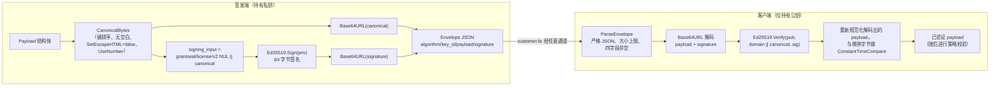

# grantseal v2 wire 协议

[English](../enUS/protocol-v2.md) | [中文文档](./protocol-v2.md) —— 返回[项目 README](../../README.md)

相关文档：[架构](./architecture.md) · [安全](../../SECURITY.md)

本文档是 grantseal v2 wire 格式的**规范性机器协议规格**。它精确记录签发端在
线路上产出、客户端验证的内容：字节级规范化、信封/payload 语法、签名输入、编码
规则与兼容性冻结。这不是产品介绍。此处每一条规则都对齐 `pkg/license` 与
`internal/issuer` 的代码、
[`pkg/license/canonical_golden_test.go`](../../pkg/license/canonical_golden_test.go)
中的 canonical golden 向量，以及
[`pkg/license/testdata/vectors/v2/`](../../pkg/license/testdata/vectors/v2/)
下的**跨语言实现向量**（参见该目录的 `README.md`）。当本文档与代码不一致时，以
代码（及其 golden 测试）为准。

## 1. Schema 版本

- 许可 payload 携带 `schema_version`，本构建**只**理解**一个**取值：
  `LicenseSchemaVersion = 2`（[`pkg/license/model.go`](../../pkg/license/model.go)）。
  其它任何取值都会 fail-closed 拒绝，返回 `LICENSE_UNSUPPORTED_SCHEMA`——不会静默
  降级到旧结构。
- 撤销列表携带独立的 `schema_version`，当前取值为 `RevocationSchemaVersion = 2`。
  相比旧的 v1 结构，v2 增加了防重放元数据（`list_id`、`sequence`、`expires_at`）。
  v1 列表默认被拒（`LICENSE_UNSUPPORTED_SCHEMA`），仅在显式 `RevocationPolicy.AllowLegacyV1`
  选择加入时才接受。
- 两个版本号相互独立：许可与撤销列表是不同的产物类别，拥有不同的签名域（见 §6）。

## 2. 规范化表示（Canonical）

签名覆盖的是唯一、确定性的字节序列——payload 的**规范化 JSON**，由
[`pkg/license/canonical.go`](../../pkg/license/canonical.go) 产出。算法为：

1. 对 Go 结构体做 `json.Marshal`，使 `time.Time` 等类型取其规范化 JSON 形式。
2. 用 `json.Decoder.UseNumber()` 解码为泛型树，保留数值精度（不重格式化浮点）。
3. 递归重新编码：
   - 每个对象的键用 Go 的 `sort.Strings` 排序（**对 UTF-8 键字节按字节字典序**，
     而非 Unicode 校对规则），
   - **无任何无意义空白**——无空格、无换行、无缩进，
   - **关闭** HTML 转义（`SetEscapeHTML(false)`），因此 `<`、`>`、`&` 原样输出，
   - `json.Number` 标量原样写出，`bool` 写作 `true`/`false`，经 Go `omitempty`
     省略的可选字段直接不输出。

这**不是** RFC 8785 JCS。特别地，它不套用 JCS 的数值规范化或 JCS 专有的字符串转义
规则；它是 grantseal 自有的键排序、无空白、不做 HTML 转义的方案。请勿假设某个通用
JCS 实现能复现这些字节。

规范化形式由 golden 向量固定。最小 payload（`schema_version = 2`、edition `basic`、
lifetime、设备模式 `none`、签发于 `2024-01-02T03:04:05Z`、id 为 `l1`/`p1`/`k1`）
规范化后**精确**为：

```
{"customer_id":"","device_binding":{"mode":"none"},"edition":"basic","grace_period_days":0,"issued_at":"2024-01-02T03:04:05Z","key_id":"k1","license_id":"l1","license_type":"lifetime","product_id":"p1","schema_version":2,"serial_number":"","version_constraint":{}}
```

golden 集中值得注意：`<`、`>`、`&` **未**被转义
（`"license_id":"l<&>2"`、`"customer_name":"Ünïcode <b>&amp;</b> 日本語"`），嵌套
map 按键排序（`"limits":{"a":1099511627776,"m":0,"z":3}`），大整数保持完整精度
（`1099511627776 == 2^40`）。

## 3. Envelope 语法

磁盘上的许可是一段 JSON `Envelope`
（[`pkg/license/envelope.go`](../../pkg/license/envelope.go)）；撤销列表是相应的
`RevocationEnvelope`（[`pkg/license/revocation.go`](../../pkg/license/revocation.go)）。
两者携带相同的四个字段：

| JSON 字段    | Go 类型     | 约束                                                    |
|-------------|-------------|---------------------------------------------------------|
| `algorithm` | `Algorithm` | 必须为 `"Ed25519"`（唯一允许取值）。                    |
| `key_id`    | `string`    | 非空；标识验签公钥。                                    |
| `payload`   | `string`    | 对**规范化** payload 字节做 Base64URL（§2、§7）。       |
| `signature` | `string`    | 对原始 Ed25519 签名做 Base64URL（§5、§7）。             |

规则：

- `payload` 是**逐字**携带的规范化字节——客户端解码并验证签发端签名的确切字节，
  绝不重新序列化，因此签发端与客户端之间没有规范化空隙。
- 磁盘文件是**美化打印**的 JSON：`MarshalJSONIndent` 使用两空格缩进、
  `SetEscapeHTML(false)`、无尾随换行。信封外层的缩进不被签名；只有解码出的
  `payload` 字节被签名。
- 解析（`ParseEnvelope` / `ParseRevocationEnvelope`）会强制大小上限（§10），按严格
  JSON 规则解码（§9），并要求**四个字段全部非空**（`algorithm`/`key_id`/`payload`/
  `signature` 任一为空即 `LICENSE_MALFORMED`）。

## 4. Payload 语法

### 4.1 许可 `Payload`

Go 结构体中的字段顺序无关紧要；被签名的是规范化形式（§2）。JSON tag、类型与
`omitempty` 均为规范性约定：

| JSON 字段            | Go 类型             | omitempty | 说明 / 约束                                                       |
|----------------------|---------------------|-----------|-------------------------------------------------------------------|
| `schema_version`     | `int`               | 否        | 必须等于 `2`（§1）。                                              |
| `license_id`         | `string`            | 否        | 必填，非空。                                                     |
| `serial_number`      | `string`            | 否        | 总是输出（可为 `""`）。                                          |
| `product_id`         | `string`            | 否        | 必填，非空。                                                     |
| `customer_id`        | `string`            | 否        | 总是输出（可为 `""`）。                                          |
| `customer_name`      | `string`            | 是        | 为空时省略。                                                    |
| `edition`            | `Edition`           | 否        | `trial`/`basic`/`professional`/`enterprise` 之一。              |
| `license_type`       | `LicenseType`       | 否        | `trial`/`subscription`/`lifetime` 之一。                        |
| `issued_at`          | `time.Time`         | 否        | 必填，非零（§8）。                                               |
| `not_before`         | `*time.Time`        | 是        | 可选；为 nil 时省略（§8）。                                      |
| `expires_at`         | `*time.Time`        | 是        | 可选；为 nil 时省略（§8，license_type 不变量）。                |
| `grace_period_days`  | `int`               | 否        | 范围 `[0, 3650]`（§10）。                                        |
| `features`           | `[]string`          | 是        | 为空时省略；基数 ≤ 256（§10）。                                 |
| `limits`             | `map[string]int64`  | 是        | 为空时省略；≤ 256 项；每个值 `[0, 2^40]`（§10）。               |
| `device_binding`     | `DeviceBinding`     | 否        | 总是输出（见 §4.2）。                                           |
| `version_constraint` | `VersionConstraint` | 否        | 总是输出（见 §4.3）；可序列化为 `{}`。                          |
| `metadata`           | `map[string]string` | 是        | 为空时省略；≤ 256 项；键/值各 ≤ 1024 字节（§10、§11）。         |
| `key_id`             | `string`            | 否        | 必填；必须等于信封 `key_id`。                                    |

### 4.2 `DeviceBinding`

| JSON 字段    | Go 类型      | omitempty | 说明                                                          |
|--------------|--------------|-----------|---------------------------------------------------------------|
| `mode`       | `DeviceMode` | 否        | `none`/`single`/`multi` 之一。                                |
| `device_ids` | `[]string`   | 是        | 为空时省略；基数 ≤ 256（§10）。                              |

模式/基数不变量（违反即 fail-closed，`LICENSE_MALFORMED`）：`none` **不得**携带
`device_ids`；`single` 要求**恰好一个**；`multi` 要求**至少一个**。对 `single`/
`multi`，每个 `device_id` 必须能解析为带版本指纹（`fp:v<N>:<algo>:<digest>`）或
显式的不透明业务标识（`opaque:<ns>:<value>`）；旧式裸值会被拒绝。

### 4.3 `VersionConstraint`

| JSON 字段             | Go 类型      | omitempty | 说明                                            |
|-----------------------|--------------|-----------|-------------------------------------------------|
| `min_version`         | `string`     | 是        | 可选的点分版本字符串。                          |
| `max_version`         | `string`     | 是        | 可选的点分版本字符串。                          |
| `maintenance_until`   | `*time.Time` | 是        | 可选；为 nil 时省略。                           |
| `covered_max_version` | `string`     | 是        | 可选；维护窗口过后仍覆盖的最高版本。            |

所有字段均 `omitempty`，因此无约束的 `version_constraint` 序列化为 `{}`（如
golden 向量所示）。

### 4.4 撤销 `RevocationList`

| JSON 字段             | Go 类型      | omitempty | 说明                                                          |
|-----------------------|--------------|-----------|---------------------------------------------------------------|
| `schema_version`      | `int`        | 否        | v2 列表必须等于 `2`（§1）。                                   |
| `list_id`             | `string`     | 是        | v2 要求非空；仅旧 v1 结构才省略。                            |
| `sequence`            | `uint64`     | 是        | v2 要求 `> 0`；单调递增的高水位。                            |
| `issued_at`           | `time.Time`  | 否        | 必填，非零（§8）。                                            |
| `expires_at`          | `*time.Time` | 是        | v2 要求非 nil 且严格晚于 `issued_at`。                        |
| `key_id`              | `string`     | 否        | 必须等于信封 `key_id`。                                       |
| `revoked_license_ids` | `[]string`   | 否        | 条目数 ≤ `MaxRevokedIDs`（§10）；空 ID 会被丢弃。            |

## 5. 签名输入（Signature input）

被签名/验证的字节序列**不是**裸规范化字节，而是：

```
signing_input = domain || canonical_bytes
```

其中 `||` 为字节拼接，`domain` 是该产物类别的域分隔符（§6，
`LicenseSigningDomain` / `RevocationSigningDomain`）。具体见
（[`pkg/license/model.go`](../../pkg/license/model.go)、
[`internal/issuer/signer.go`](../../internal/issuer/signer.go)、
[`pkg/license/verifier.go`](../../pkg/license/verifier.go)）：

- **算法**：仅 Ed25519。公钥 = 32 字节，签名 = 64 字节。解码后长度不为 64 的签名
  在验证前即被拒绝。
- **许可**：签发时 `Ed25519.Sign(priv, LicenseSigningInput(canonical))`；验签时
  `Ed25519.Verify(pub, LicenseSigningInput(canonical), sig)`，其中
  `LicenseSigningInput(c) = "grantseal/license/v2\x00" || c`。
- **撤销**：相应地 `RevocationSigningInput(c) = "grantseal/revocation/v2\x00" || c`。
- **规范化相等校验。** 签名有效后，验证器会重新规范化解码出的结构体，并用
  `crypto/subtle.ConstantTimeCompare` 与携带的 `payload` 字节比较。若二者不同
  （非规范化键序、空白等绕过了签名），则以 `LICENSE_NON_CANONICAL_PAYLOAD` 拒绝。
  payload 内嵌的 `key_id` 也必须等于信封 `key_id`（否则 `LICENSE_KEY_ID_MISMATCH`）。

## 6. 域分隔符（Domain separator）

两个固定域字符串，各以单个 NUL 字节结尾，在签名/验证前被前置到规范化字节：

- 许可：`grantseal/license/v2\x00`
- 撤销：`grantseal/revocation/v2\x00`

末尾的 `\x00` 是被签名字节的一部分。域分隔保证为某一产物类别（许可）产生的签名
永远无法被重放为另一类别（撤销列表），即便攻击者能为两者构造相同的规范化字节。
更改任一前缀即形成新的签名域，是破坏性的协议变更（§12）。本构建执行一次性干净升级，
对许可**不**接受无前缀（域分隔之前）的签名；对撤销，会拒绝仅能对裸旧输入验证通过的
v2-schema 体。

## 7. Base64URL 规则

两个信封中的 `payload` 与 `signature`——以及被编码处的公钥——使用 Go 的
`base64.URLEncoding`（[`pkg/license/envelope.go`](../../pkg/license/envelope.go)）：

- **仅 URL-safe 字母表**（`-` 与 `_`）。标准字母表（`+`、`/`）会被拒绝。
- **必须带 padding**（`=`），因为使用的是 `URLEncoding`（而非 `RawURLEncoding`），
  它输出并要求 padding。无 padding 的输入会被拒绝。
- 任何解码错误映射为 `LICENSE_MALFORMED`（如 `invalid base64 payload` /
  `invalid base64 signature`）。

## 8. 时间戳规则

- 所有时间戳是 Go `time.Time`，以 RFC 3339 形式序列化，并按 **UTC** 比较
  （golden 向量中为 `2024-01-02T03:04:05Z`）。
- 时间比较默认容忍 **±5 分钟**时钟偏移
  （`DefaultClockSkew`，[`pkg/license/clock.go`](../../pkg/license/clock.go)），
  可按调用配置。
- 许可时间不变量（静态、安全关键）：
  - `issued_at` 必填且非零。
  - `expires_at` 存在时不得早于 `not_before`，也不得早于 `issued_at`；
    `not_before` 存在时不得早于 `issued_at`。
  - `trial` 与 `subscription` **要求** `expires_at`；`lifetime` **不得**携带
    `expires_at`。任一违反即 `LICENSE_MALFORMED`。
- 撤销时间不变量：v2 要求 `issued_at` 非零、`expires_at` 非 nil、且 `expires_at`
  严格晚于 `issued_at`（结构性，恒强制）。分发新鲜度（`issued_at` 不在未来、列表
  未超 `expires_at`/`MaxAge`）是唯一可经 `WithoutFreshness` 放宽的层。

## 9. 未知字段策略

不受信 JSON 经由唯一的严格收窄点解析
（[`pkg/license/strictjson.go`](../../pkg/license/strictjson.go)），依次为：

- 解析前先检查**大小上限**（§10）。
- 在树的任意位置**拒绝重复对象键**（token 级扫描），封堵 JSON 走私/歧义向量。
- **`DisallowUnknownFields`**——任何不在结构体中的字段都会被拒绝。
- **恰好一个顶层值**——值之后的任何尾随 token、值或非空白字节（含 NUL）都会被拒绝。

后果：**任何未知字段都会破坏兼容性。** 不存在向前兼容的"忽略未知"行为。向线路
（树中任意位置）新增字段都是破坏性变更（§11、§12）。

该完整收窄点（`decodeStrictJSON`）适用于许可 `Envelope`、许可 `Payload` 与外层
`RevocationEnvelope`。内层 `RevocationList` 走的是更窄的解码路径（仅
`DisallowUnknownFields`，不含重复键/`UseNumber` 的 token 级扫描）；其对重复键与
非规范化字节的等效防护来自强制的规范化相等校验（§5）——重新编码解码出的列表并与
携带字节做常量时间比较，凡不是规范化形式的一律拒绝。

## 10. 整数与大小上限

规范性边界（[`pkg/license/model.go`](../../pkg/license/model.go)），fail-closed 强制：

- `grace_period_days`：`[0, 3650]`。
- 每个 `limits` 值：`[0, 2^40]`（`maxLimitValue = 1 << 40`）；空 limit 键与负值
  会被拒绝。
- 集合基数（各 ≤ 256）：`MaxFeatures`、`MaxLimits`、`MaxDeviceIDs`、
  `MaxMetadataEntries`。
- `metadata` 键/值长度：≤ `MaxMetadataKeyLen`/`MaxMetadataValLen`（各 1024 字节）。
- 撤销条目数：≤ `MaxRevokedIDs = 100000`；撤销 `sequence` 为 `uint64`，v2 下必须
  `> 0`。
- 文件大小上限（解析前检查）：许可 `MaxLicenseFileSize = 64 KiB`；撤销
  `MaxRevocationFileSize = 4 MiB`；回拨状态 `MaxRollbackStateSize = 4 KiB`。

## 11. 扩展策略

- v2 中**唯一**的开放扩展位是许可的 `metadata` map（`map[string]string`，受 §10
  约束）。签发端可在其中携带额外应用数据而无需 schema 变更。
- 由于解析为 `DisallowUnknownFields` + 拒重复键 + 拒尾随数据（§9），**新增、删除或
  重命名任何顶层字段**——无论在信封、payload、`device_binding`、
  `version_constraint` 还是撤销列表上——都是**破坏性 wire 变更**，需要 schema 版本
  提升外加新的签名域，而非一次可加性 Go API 变更。
- 更改字段的 JSON tag、类型、`omitempty` 行为、枚举白名单、规范化、编码、域分隔符
  或上述任一上限，同样是破坏性的。

## 12. 兼容性与冻结声明

**v2 wire 格式在 v1.0 之后冻结。** 从 `1.0.0` 起，新增、修改或删除任何影响线路
字节、规范化表示、签名输入、域分隔符或编码规则的内容——包括向 `Payload` 新增字段
——都是**需要 MAJOR 版本提升并附迁移说明的破坏性变更**。向 `Payload` 加字段不再是
普通的 Go API 变更；它是协议破坏，需按 wire / canonical / signature 兼容性评估。

**v2 wire format is frozen after v1.0.**

### 字节流：签发 → 验签



## 13. 跨语言实现一致性向量

冻结的 v2 协议随附一套**跨语言实现向量**，位于
[`pkg/license/testdata/vectors/v2/`](../../pkg/license/testdata/vectors/v2/)，
以便 Rust / Python / Java / Node（或任意其它语言）实现无需链接 Go 即可验证兼容
性。完整 schema 与消费指南见该目录的 `README.md`。

- 每个向量都由单一的**固定 32 字节 Ed25519 seed** 派生（`vectors.json` 的
  `seed_hex`）。用这些确切字节做 seed 即可复现记录的公钥与全部签名；仅做验签的
  实现可忽略 seed，直接用记录的公钥校验记录的签名。
- 每个 `*.json` 向量自成一体：完整信封、精确的 canonical payload 字符串、
  `signing_input_hex`（= `domain ‖ canonical`）、签名、验签公钥、策略输入
  （`product_id` / `now` / skew / 设备指纹），以及 `expected` 结果与稳定的
  `expected_code`。
- 向量集覆盖 `valid-basic`、`valid-lifetime`、`valid-subscription`、
  `valid-device-bound`，以及负例 `invalid-signature`
  （`LICENSE_SIGNATURE_INVALID`）、`invalid-keyid`（`LICENSE_KEY_ID_MISMATCH`）、
  `invalid-noncanonical`（`LICENSE_NON_CANONICAL_PAYLOAD`）与
  `invalid-duplicate-key`（`LICENSE_MALFORMED`）。
- Go 侧在每次 `go test` 时消费这些向量
  （[`pkg/license/vectors_test.go`](../../pkg/license/vectors_test.go)）；外部实现
  对同一批文件运行相同的循环。仅在经过评审的协议变更后才重新生成：
  `go test ./pkg/license -run TestGenerateCrossImplVectors -update`。对任何已提交
  向量的改动都是破坏性 wire 变更（§12）。
